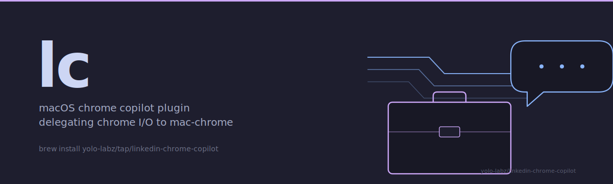

<picture>
  <source media="(prefers-color-scheme: dark)" srcset="docs/assets/hero-dark.svg">
  <source media="(prefers-color-scheme: light)" srcset="docs/assets/hero-light.svg">
  
</picture>

<div align="center">

# linkedin-chrome-copilot

**Claude Code plugin that drives LinkedIn workflows on macOS Chrome via the [claude-mac-chrome](https://github.com/yolo-labz/claude-mac-chrome) sibling plugin.**

Per-locale profile-edit forms, message-triage routing, profile audit. Plain markdown save-state, PII-scanner CI gate, no committed contact data.

[](https://github.com/yolo-labz/linkedin-chrome-copilot/actions/workflows/ci.yml)
[](./LICENSE)
[](https://conventionalcommits.org)
[](https://scorecard.dev/viewer/?uri=github.com/yolo-labz/linkedin-chrome-copilot)
[](#platform-support)

[Capability](#capability) · [Demo](#demo) · [Compares](#how-linkedin-chrome-copilot-compares) · [Capabilities](#capabilities) · [Architecture](./docs/ARCHITECTURE.md) · [Security](./SECURITY.md)

</div>

---

## Capability

**Pattern.** LinkedIn copilot plugin for Claude Code that delegates every Chrome I/O call to [claude-mac-chrome](https://github.com/yolo-labz/claude-mac-chrome) — a single Patchright surface owns the browser; five single-purpose skills (`resume`, `draft-reply`, `book-slot`, `tailor-cv`, `guardrails`) compose into the copilot. <!-- stealth-allow: skill names -->

**Trade-off.** macOS-only (AppleScript-bound sibling plugin) and operator-paste-only message sends (ban-risk resistance on a watched account), in exchange for one shared Chrome session, channel-aware register selection, and a hard PII-scan CI gate over every committed file.

**Use when.** An agent needs to replay session state, draft channel-aware replies, propose timezone-labeled calendar slots, build a document variant against a target keyword set, or evaluate a candidate action against the YAML policy — without auto-submitting on the LinkedIn surface.

```bash
brew install yolo-labz/tap/linkedin-chrome-copilot
lc-resume                # session pipeline state + next action
lc-tailor --jd <url>     # document variant builder
```

## Demo

A narrative workflow diagram (no LinkedIn UI capture; PII surface is too wide) is checked into the repo as a Catppuccin Mocha SVG with a Latte variant. Five skill nodes orbit a central `copilot` orchestrator, each carrying an `<title>`+`<desc>` ARIA pair. Render locally:

```bash
# macOS preview
open docs/assets/lc-workflow.svg
# or render to PNG for a screenshot
rsvg-convert -w 1200 docs/assets/lc-workflow.svg -o /tmp/lc-workflow.png
```

The dark variant lives at [`docs/assets/lc-workflow.svg`](./docs/assets/lc-workflow.svg); the light (Latte) variant at [`docs/assets/lc-workflow-light.svg`](./docs/assets/lc-workflow-light.svg). Every node and edge is a static vector — no animations, no gradients, no LinkedIn logo (trademark).

## How `linkedin-chrome-copilot` compares

Closest peers in the LinkedIn-automation space:

| Capability                                                  | `linkedin-chrome-copilot` (this repo) | [Phantombuster](https://phantombuster.com) | manual operation |
|-------------------------------------------------------------|:---:|:---:|:---:|
| PII-scan CI hard gate (`tools/pii-scan.sh`)                 | yes | no  | n/a |
| Operator-paste-only message sends (ban-risk resistance)     | yes | no — auto-sends | yes |
| Chrome delegation to a single Patchright surface            | yes | no — cloud      | yes (operator browser) |
| JSON Schema draft-07 fixture validation in CI               | yes | no  | no  |
| Conventional Commits + DCO sign-off + Co-Author trailer     | yes | n/a | n/a |
| Multi-channel register policy (LinkedIn / email / WhatsApp / GitHub) | yes — `config/guardrails.yaml` | LinkedIn only | manual |
| Plain-markdown save-state (no SaaS lock-in)                 | yes | no — cloud DB   | n/a |
| Locale-variant sync across EN / PT / ES profile forms       | yes | no  | manual |

The shape of the problem here is a single-operator Claude Code copilot that the operator pastes into a live Chrome session — not a bulk-outreach SaaS. If a fully autonomous outreach engine is what you want, the alternatives above are a closer fit.

## Capabilities

- **Per-locale profile edits** — drives `/details/experience/edit/forms/<id>/?language=<lang>&country=<cc>` saves across PT/EN/ES locale slots via `execCommand('insertText')` + Save-button event-chain click.
- **Message triage** — channel-aware drafting (LinkedIn DM tone ≠ email tone ≠ WhatsApp tone) gated through guardrails policy.
- **Send verification** — re-reads DOM after every send; never silently promotes `pending` to `sent`.
- **Calendar slot booking** — free-window check against guardrails policy + explicit timezone labels on every output.
- **Document tailoring** — keyword-coverage reports + dated filename convention for per-target document variants.
- **Locale-variant sync** — propagates profile edits across EN + PT + ES slots with diff verification.
- **Workflow guardrails** — deep-work block guard, async-preference enforcement, quarterly reset injection at quarter boundaries.

## Platform support

**macOS 13+ only.** Every skill exits early with a clear diagnostic on Linux / Windows. By design: Chrome automation goes through AppleScript via the sibling plugin, which has no Linux / Windows equivalent.

## Prerequisites

- Google Chrome with at least one profile signed in.
- Claude Code.
- [claude-mac-chrome](https://github.com/yolo-labz/claude-mac-chrome) ≥ 1.1.1 installed alongside this plugin.
- `gh`, `jq`, `bats-core`, `shellcheck`, `shfmt` on `PATH` (`brew install bats-core shellcheck shfmt jq gh`).
- Optional: `pandoc` or `typst` for document PDF rendering.

## Install

```bash
git clone https://github.com/yolo-labz/linkedin-chrome-copilot.git ~/code/linkedin-chrome-copilot
claude plugins install ~/code/linkedin-chrome-copilot
```

## Quickstart

See [docs/QUICKSTART.md](./docs/QUICKSTART.md) for the 8-step operator flow. First-run target: resume a session against fixture data in under 10 minutes.

## Privacy — no PII in fixtures (hard rule)

All fixtures committed to this repo are **100% synthetic**. Real contact data lives in a local-only alias map at `~/.config/linkedin-copilot/aliases.json` (chmod 600, gitignored, never leaves your machine). Every PR runs `tools/pii-scan.sh` against committed files; any hit on email / phone / Calendly URL / common-name blocklist fails the build.

If you contribute a fixture, **use obvious placeholders**: `contact-a7`, `contact at example dot invalid`, `calendly example slug`. See [docs/PII-POLICY.md](./docs/PII-POLICY.md).

## Architecture (one-liner)

Skills are single-purpose shell scripts; agents are prompt files that orchestrate skills; commands are slash-command entry points; hooks enforce platform + save-state load; schemas are JSON Schema (draft-07) validated against fixtures in CI. Chrome I/O is 100% delegated to `claude-mac-chrome` via `tools/chrome-shim.sh`. See [docs/ARCHITECTURE.md](./docs/ARCHITECTURE.md).

## Sibling plugins

- [yolo-labz/claude-mac-chrome](https://github.com/yolo-labz/claude-mac-chrome) — required dependency. Drives Chrome via AppleScript JS-injection + cliclick.
- [yolo-labz/wa](https://github.com/yolo-labz/wa) — WhatsApp daemon. Composes with this plugin for cross-channel automation in one save-state.

## License

MIT. See [LICENSE](./LICENSE).

## Security

Report vulnerabilities privately via GitHub Private Vulnerability Reporting. See [SECURITY.md](./SECURITY.md).
